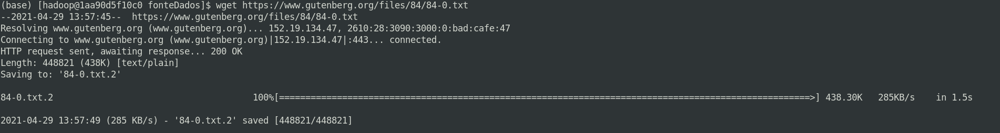
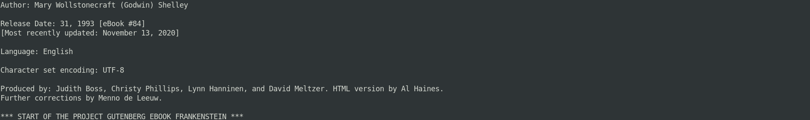
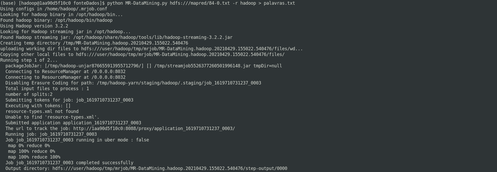
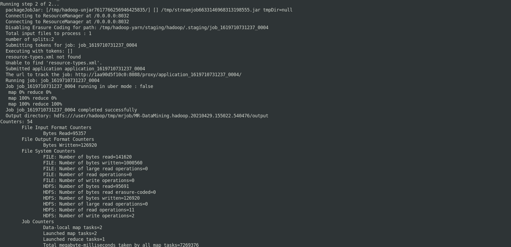
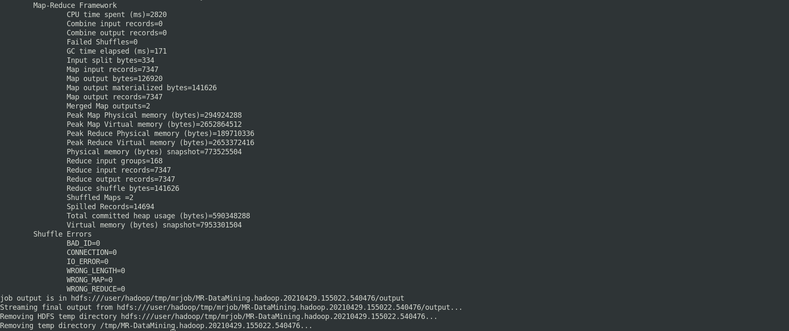

# Usando Python com MRJob para gerar jobs MapReduce


Este artigo foi inspirado no conteúdo do curso de Formação de Cientista de Dados, módulo Engenharia de Dados com Hadoop e Spark na Data Science Academy [http://www.datascienceacademy.com.br](http://www.datascienceacademy.com.br) 


O Hadoop MapReduce é uma ferramenta para escrever aplicativos que processam grandes quantidades de dados em paralelo em clusters de hardware de maneira confiável e tolerante a falha. O objetivo central deste artigo é abordar como trabalhar com MapReduce pode ser útil para uma empresa. Propõe-se, assim, apresentar um exemplo de análise de dados. 


###  Análise de Dados com Hadoop MapReduce


Trabalharemos neste exemplo, com um conjunto de dados pequeno em um container Docker com Apache Hadoop Pseudo Distribuido: Ambiente de teste.


### Fonte de dados

Para exemplificarmos, uma das várias formas de solução deste problema, baixaremos um livro (que pode ser considerado um conjunto de dados não estruturados) da livraria on line Project Gutenberg.

Project Gutenberg
[https://www.gutenberg.org/about/](https://www.gutenberg.org/about/)


### Pré-requisitos:  

- Máquina local ou virtual com sistema operacional Linux;
- [Python Fundamentos para Análise de Dados](https://www.datascienceacademy.com.br/course?courseid=python-fundamentos);
- [Java(TM) SE Runtime Environment (build 1.8.0_281-b09)](https://www.java.com/pt-BR/download/ie_manual.jsp?locale=pt_BR);
- [Docker instalado e configurado](https://www.docker.com/get-started); 
- [Apache Hadoop Pseudo Cluster instalado e configurado](https://github.com/carlosemsantana/docker-hadoop);
- [Anaconda Python instalado](https://www.anaconda.com/products/individual#Downloads);
- [MRJOB - Biblioteca de mapeamento e redução para Python](https://github.com/Yelp/mrjob);
- Livro (ou outro qualquer): Frankenstein; Or, The Modern Prometheus by Mary Wollstonecraft Shelley<br>
[https://www.gutenberg.org/ebooks/84](https://www.gutenberg.org/ebooks/84)


### Definição do problema:


Criar um programa para realizar [Data Mining](https://pt.wikipedia.org/wiki/Minera%C3%A7%C3%A3o_de_dados) em um conjunto de dados não estruturados, e contabilizar quantas vezes cada palavra apareceu.


### Atividades:


1) Baixar o Dataset;

<!-- #region -->
```bash 
$ wget https://www.gutenberg.org/files/84/84-0.txt
```
<!-- #endregion -->




2) Examinar a fonte de dados;

<!-- #region -->
```bash 
$ head -n 100 84/84-0.txt
```
<!-- #endregion -->

Percebemos por observação, estamos trabalhando com dados não estruturados.





Realizaremos o processamento direto no ambiente de teste Hadoop.


3) Programação


Para nos ajudar a escrever e executar jobs mapreduce usaremos a biblioteca open source [MRJob](https://github.com/Yelp/mrjob) para Python. 


O próximo passo é escrever o programa em Python (MRDataMining.py) para gerar o job que irá responder a pergunta do cliente.


<!-- #region -->
```python
# MRjob é um pacote Python que nos ajuda a escrever e executar 
# Hadoop Streaming jobs.
# https://github.com/Yelp/mrjob
from mrjob.job import MRJob
from mrjob.step import MRStep
# RE é um módulo que permite criar regras com expressões regulares.
# https://docs.python.org/3/library/re.html
import re

# REGEXP_PALAVRA rebece fluxo dados filtrados, neste exemplo, 
# somente PALAVRAS. (Ignorando todo resto)
REGEXP_PALAVRA = re.compile(r"[\w']+")

class MRDataMining(MRJob):

    # O método steps(), cria um pipeline sequencial, para 
    # execução das tarefas de mapeamento e redução.
    def steps(self):
        return [
            MRStep(mapper = self.mapper_get_words, reducer = self.reducer_count_words),
            MRStep(mapper = self.mapper_make_counts_key, reducer = self.reducer_output_words)
        ]

    # Método mapper_get_words() prepara as palavras do fluxo de dados
    def mapper_get_words(self, _, line):
        palavras = REGEXP_PALAVRA.findall(line)
        for palavra in palavras:
            yield palavra.lower(), 1
            
    # Método reducer_count_words() contabiliza as palavras
    def reducer_count_words(self, palavra, values):
        yield palavra, sum(values)

    # Método mapper_make_counts_key() formata e padroniza a saída da informação
    def mapper_make_counts_key(self, palavra, count):
        yield '%04d'%int(count), palavra
        
    # Método reducer_output_words() gera nova saída com dados finalizados   
    def reducer_output_words(self, count, palavras):
        for palavra in palavras:
            yield count, palavra


if __name__ == '__main__':
    MRDataMining.run()
```
<!-- #endregion -->

A próxima etapa é testar o código.


4) Testar o código


5) Executar o job


Após copiar o programa para o ambiente Hadoop, a fonte de dados para o HDFS.

<!-- #region -->
```bash 
$ hdfs dfs -put 84-0.txt /mapred/84-0.txt
```
<!-- #endregion -->


<!-- #region -->
```bash 
$ python MRDataMining.py hdfs:///mapred/84-0.txt -r hadoop > palavras.txt
```
<!-- #endregion -->

#### Processamento distribuído











Fim do processamento, agora vamos examinar o resultado no arquivo palavras.txt que foi gerado.


Lá está. O arquivo foi gerado com duas colunas, quantidade de repetições e a palavras. Com base nessa informação, você pode dar continuidade ao trabalho, apresentar os resultado ao tomador de decição ou alimentar um dashboard.


### Conclusão


Abordarmos através dos exercícios [1](https://github.com/carlosemsantana/docker-mapreduce) e [2](https://github.com/carlosemsantana/docker-mapreduce/DataMining.md), como usar o Python com MRJob para gerar de forma simples e executar tarefas MapReduce no ambiente Hadoop.


Voltar ao início do Artigo: [https://github.com/carlosemsantana/docker-mapreduce](https://github.com/carlosemsantana/docker-mapreduce)


Espero ter contribuido com o seu desenvolvimento de alguma forma.


[Carlos Eugênio Moreira de Santana](https://carlosemsantana.github.io/)


### Referências


- [http://www.datascienceacademy.com.br](http://www.datascienceacademy.com.br)<br>
- [https://hadoop.apache.org/docs/current/hadoop-mapreduce-client/hadoop-mapreduce-client-core/MapReduceTutorial.html](https://hadoop.apache.org/docs/current/hadoop-mapreduce-client/hadoop-mapreduce-client-core/MapReduceTutorial.html)<br>
- [https://hadoop.apache.org/docs/current/hadoop-yarn/hadoop-yarn-site/YARN.html](https://hadoop.apache.org/docs/current/hadoop-yarn/hadoop-yarn-site/YARN.html)<br>
- [https://hadoop.apache.org/docs/current/hadoop-project-dist/hadoop-hdfs/HdfsDesign.html](https://hadoop.apache.org/docs/current/hadoop-project-dist/hadoop-hdfs/HdfsDesign.html)<br>
- [https://github.com/Yelp/mrjob](https://github.com/Yelp/mrjob);

```python

```
