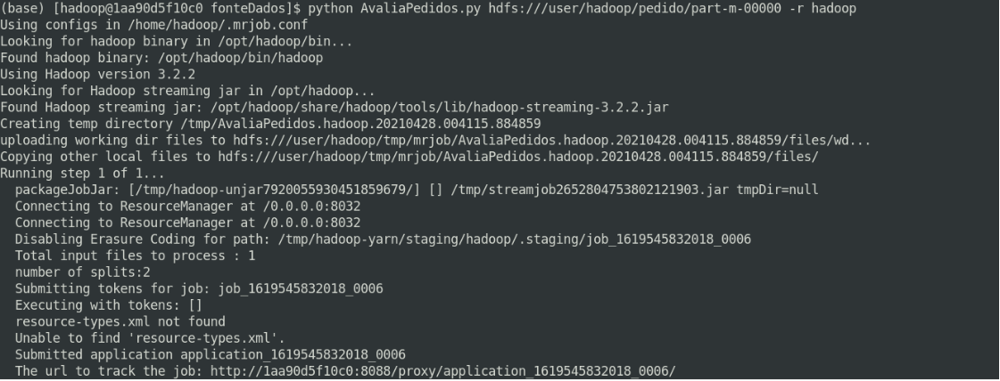
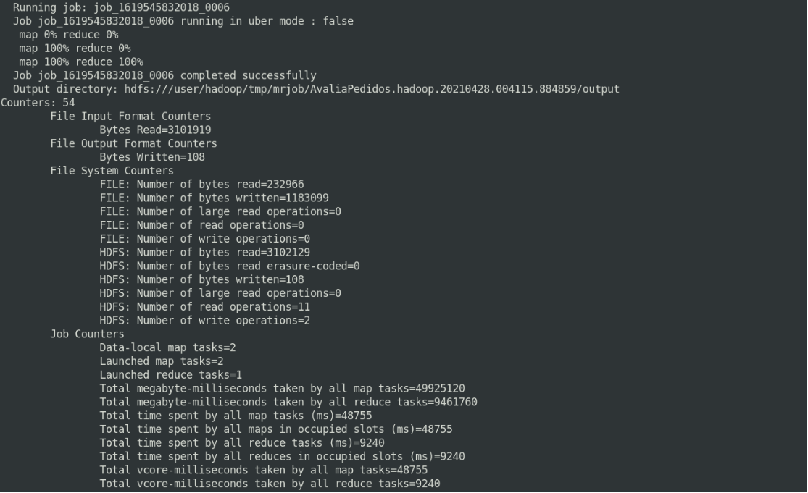
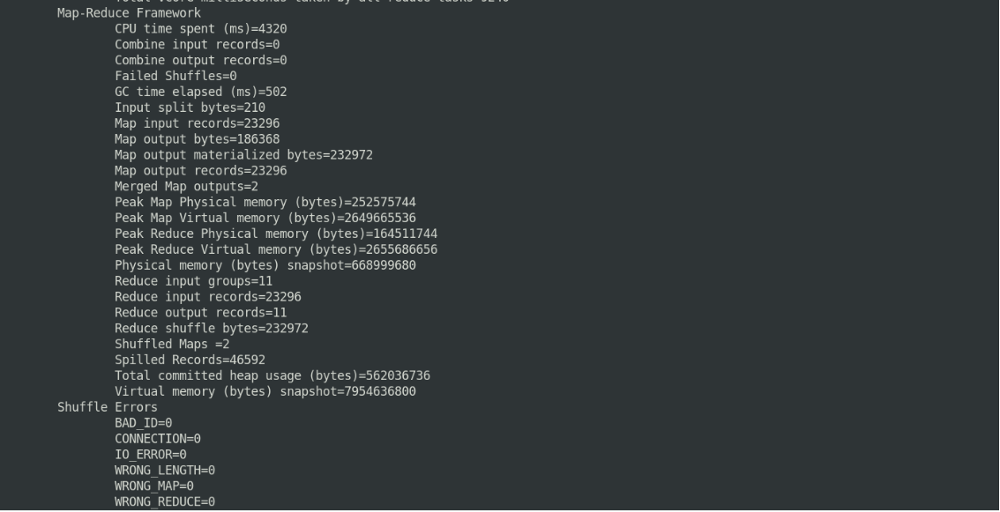

# Usando MapReduce em Grandes Volumes de Dados: Job MapReduce


Este artigo foi inspirado no conteúdo do curso de Formação de Cientista de Dados, módulo Engenharia de Dados com Hadoop e Spark na Data Science Academy [http://www.datascienceacademy.com.br](http://www.datascienceacademy.com.br) 


O Hadoop MapReduce é uma ferramenta para escrever aplicativos que processam grandes quantidades de dados em paralelo em clusters de hardware de maneira confiável e tolerante a falha. O objetivo central deste artigo é abordar como trabalhar com MapReduce pode ser útil para uma empresa. Propõe-se, assim, apresentar um exemplo de análise de dados.


### Hipótese


Um cientista de dados é contratado para trabalhar em um projeto de análise com grande volume, na casa de milhões, bilhões ou na casa de petabytes de registros. Aonde irá armazenar e processar esse volume de dados?

Se o profissional for trabalhar com banco de dados relacional, não terá ambiente distribuído a sua disposição, e ao executar a tarefa de análise não terá desempenho suficiente para o seu processo, e quando o trabalho estiver sendo processando, com yottabytes, será inviável. 


###  Análise de Dados com Hadoop MapReduce


Trabalharemos neste exemplo, com um conjunto de dados pequeno em um container Docker com Apache Hadoop Pseudo Distribuido: Ambiente de teste.


### Pré-requisitos:  

- Máquina local ou virtual com sistema operacional Linux;
- [Python Fundamentos para Análise de Dados](https://www.datascienceacademy.com.br/course?courseid=python-fundamentos);
- [Java(TM) SE Runtime Environment (build 1.8.0_281-b09)](https://www.java.com/pt-BR/download/ie_manual.jsp?locale=pt_BR);
- [Docker instalado e configurado](https://www.docker.com/get-started); 
- [Apache Hadoop Pseudo Cluster instalado e configurado](https://github.com/carlosemsantana/docker-hadoop);
- [Anaconda Python instalado](https://www.anaconda.com/products/individual#Downloads);
- [MRJOB - Biblioteca de mapeamento e redução para Python](https://github.com/Yelp/mrjob);


### Definição do problema


Criar um programa para contabilizar quantos registros de transações e-commerce realizados em uma loja virtual na Internet foram aprovados, cancelados e abandonados desde que a loja foi inaugurada.

### Cenário atual
O servidor de banco de dados está hospedado em um Provedor de Serviços na Internet, e seu programa deve ser capaz de analisar e processar pentabytes de registros.


### Proposição

Nesse caso, trazemos os dados para o Apache Hadoop HDFS, para que possamos usar as vantagens de ter um ambiente distribuído em cluster de computadores. Com isso será possível armazenar e processar grandes volumes de dados de forma distribuída. 

Uma vez que os registros estejam armazenados no HDFS será possível realizamos o trabalho de análise e processamento dos dados com o Apache Hadoop Map Reduce de maneira distribuída.

Trabalhar com Apache Hadoop Map Reduce é uma <u>sugestão</u>, alternativamente, podemos usar o Apache Spark, o Apache Storm, entretanto, o Apache Hadoop Map Reduce é o mais indicado, porque foi desenvolvido para processar volumes realmente grande de dados, na casa de petabyte ou yottabyte de dados.


# Atividades 


Para ilustrarmos este exemplo, vamos aproveitar o dataset gravado no artigo anterior <b>Importando Dados do MySQL para o HDFS com Sqoop</b> e considerar que o ambiente com Hadoop já existe. 

Datasert: [https://github.com/carlosemsantana/docker-mysql-hdfs](https://github.com/carlosemsantana/docker-mysql-hdfs)


### Coleta dos dados


A primeira tarefa seria importar os dados do banco de dados relacional que está no Provedor de Serviços e gravar no HDFS. Esta é uma das atividades do Engenheiro de Dados, porém, em algumas situações o Cientista de Dados precisará exercer temporariamente este papel.


### Examinar os dados


Quando terminar atividade de coleta de dados, copie os arquivos gerados do HDFS para sua máquina local para que possa examinar e entender os dados.


Exibir a fonte de dados:

<!-- #region -->
```bash 
$  hdfs dfs -ls /user/hadoop/pedido
``` 
<!-- #endregion -->

A fonte de dados com as transações da loja foi gravada no HDFS no diretório pedido.


Baixar a fonte de dados:

<!-- #region -->
```bash 
$  hdfs dfs -get /user/hadoop/pedido/* /home/hadoop/fonteDados/
``` 
<!-- #endregion -->


A fonte de dados com as transações da loja foi gravada na máquina local, agora, vamos examinar o conteúdo do arquivo e enteder os dados para criarmos o programa de análise que irá responder as pergutas do cliente.

<!-- #region -->
```bash 
$  head /home/hadoop/fonteDados/part-m-00000
``` 
<!-- #endregion -->


No formato que os dados estão, será importante obter mais informações para ajudar no entendimento.


Em contato com equipe desenvolvimento do cliente, conseguimos nome e descrição dos atributos da fonte de dados disponibilizada.


Neste exercício o que precisamos responder: Quantas transações e-commerce realizadas na loja virtual foram aprovados, cancelados e abandonados desde que a loja foi inaugurada?


Estamos prontos para criar o programa que irá contabilizar registros e gerar a resposta para o cliente.


### Programação


Para nos ajudar a escrever e executar jobs mapreduce usaremos a biblioteca open source [MRJOB](https://github.com/Yelp/mrjob) para Python.

<!-- #region -->
A instalação do MRJOB é simples, digite: 

```bash 
$ pip install mrjob 
```
<!-- #endregion -->

Pronto! crie um arquivo de configuração do mrjob com nome de ```.mrjob.conf``` no diretório home do usuário hadoop.


<!-- #region -->
```bash 
$ touch /home/hadoop/.mrjob.conf 
```
<!-- #endregion -->

Edite o arquivo:

<!-- #region -->
```bash 
$ nano /home/hadoop/.mrjob.conf 
```
<!-- #endregion -->

Copie o código abaixo para o arquivo <b>.mrjob.conf </b> e mantenha a identação: 

<!-- #region -->
```bash
runners: 
	hadoop:
		python_bin: /home/hadoop/anaconda3/bin/python
```
<!-- #endregion -->

O próximo passo é escrever o programa em Python. Criei o AvaliaPedidos.py (código abaixo)

<!-- #region -->
```python
from mrjob.job import MRJob

class MRAvaliaPedidos(MRJob):
    def mapper(self, key, line):
        (x1, x2, x3, x4, x5, x6, x7, x8, x9, x10, x11, status_pedido_codigo) = line.split(',')
        yield status_pedido_codigo, 1

    def reducer(self, status_pedido_codigo, ocorrencias):
        yield status_pedido_codigo, sum(ocorrencias)

if __name__ == '__main__':
    MRAvaliaPedidos.run()
```
<!-- #endregion -->

#### MRAvaliaPedidos(MRJob)


Um Job é definido por uma classe que herda de MRJob. Esta classe contém métodos que definem as etapas do seu trabalho.<br>
No script que foi criado temos: Uma “etapa” que consiste em um <b>mapper()</b> e um <b>reducer()</b>, porque temos apenas um passo.<br>
O método <b>mapper()</b> usa uma chave e um valor como argumentos e produz quantos pares de chave-valor houver.<br>
O método <b>reducer()</b> pega uma chave e um iterador de valores e também produz quantos pares de chave-valor houver.<br>
(Nesse caso, ele soma os valores de cada chave, que representam o número de transações, por tipo de pedidos ou transações finalizadas na loja virtual.)


### O que está acontecendo?


Na prática, o objeto criado <b>MRAvaliaPedidos()</b> lê o arquivo <b>part-m-00000</b> onde estão as transações que iremos analisar, ignora as colunas de x1 a x11 e contabiliza somente os valores encontrados na coluna <b>status_pedido_codigo</b>.


### Testar o código


Primeiro vamos testar o código na máquina local, usando o arquivo que foi copiado do DataLake com os registros das transações. Localmente não vamos trabalhar com o volume total dos dados, neste momento estamos avaliando o código e os resultados. Após a validação o programa será executado no Hadoop.

<!-- #region -->
```python
$ python AvaliaPedidos.py part-m-00000 
```
<!-- #endregion -->


Examinando o resultado percebemos que os status estão sendo contabilizados.<p>

<b>Os tipos de pedidos e respectivos códigos são:</b>

     - aprovados; 500, 501,600 = (480 + 12 + 908 = 1400)
     - cancelados; 105,200,201,202 = (64 + 1862 + 30 = 1956)
     - devolvidos; 700,800 = (1 + 11 = 12)
     - abandonados; 100,101,102,103,300,400 = (18316 + 1159 = 19475)


Feito! o código está funcionando. Copiaremos o programa para o ambiente do Hadoop.


### Análise dos dados


#### As fases da execução do job no Hadoop MapReuce são:


<b>Agendamento</b> - Os jobs são divididos em pedaços menores chamados tarefas. As tarefas são agendadas pelo YARN (Gerenciador de recursos).<br>
<b>Localização de tarefas</b> - As tarefas são colocadas nos nodes que armazenam os segmentos de dados. O código é movido para onde o dado está.<br>
<b>Tratamento de erros</b> - Falhas são um comportamento esperado e no caso de falhas, as tarefas são automaticamente enviadas a outros nodes.<br>
<b>Sincronização dos dados</b> - Os dados são randomicamente agrupados e movidos entre os nodes. Imput e Output são coordenados pelo framework.


#### YARN


Apache YARN é a camada de gerenciamento de recursos e agendamento de tarefas (jobs) do Hadoop, roda acima do HDFS. O Apache YARN é considerado 
como o sistema operacional de dados do Hadoop. A arquitetura do YARN fornece uma plataforma de processamento de dados de uso geral que não
se limita apenas ao MapReduce.


#### Executando o programa AvaliaPedidos.py


Primeiro localizarei onde está o arquivo de dados que foi gravado no Hadoop HDFS.

<!-- #region -->
```bash 
$ hdfs dfs -ls /user/hadoop/pedido/part-m-00000
```
<!-- #endregion -->


Executando o JOB: Copie o AvaliaPedidos.py da máquina local para o ambiente Hadoop e execute.

<!-- #region -->
```bash 
$ python AvaliaPedidos.py hdfs:///user/hadoop/pedido/part-m-00000 -r hadoop 
```
<!-- #endregion -->

#### As fases da execução do AvaliaPedidos no Hadoop MapReuce são:


#### Fase 1 – Mapeamento

A palavra reservada yield define qual das colunas será a chave (nesse caso a coluna status_pedido_codigo, pois queremos saber o total de transações que foram cancelados, aprovados e abandonados). Cada status_pedido_codigo é mapeado e identificado  com  o  valor  1,  registrando  a  ocorrência  do  status_pedido_codigo. 








#### Fase 2 – Shuffle e Sort

Essa fase é processada automaticamente pelo framework MapReduce, que então agrupa os status_pedido_codigo e identifica quantas ocorrências cada status_pedido_codigo obteve ao longo do arquivo.





#### Fase 3 –Redução

Esta fase aplica o cálculo matemático (no caso soma, com a função sum()) e retorna o resultado: total de transações com total de status_pedido_codigo 100,200 ,.., e 800


Pronto. Lá está a resposta que o cliente está aguardando. A próxima etapa deste mini-projeto seria: documentar, disponibilizar o programa, gerar um relatório e apresentar os resultados.


### Conclusão


Abordarmos através de exemplo hipotético simples como Apache Hadoop MapReduce tem a capacidade de fornecer às organizações uma forma eficiente de lidar com o volume. 


Espero ter contribuido com o seu desenvolvimento de alguma forma.


[Carlos Eugênio](https://carlosemsantana.github.io/)


### Referências:


- [http://www.datascienceacademy.com.br](http://www.datascienceacademy.com.br)<br>
- [https://hadoop.apache.org/docs/current/hadoop-mapreduce-client/hadoop-mapreduce-client-core/MapReduceTutorial.html](https://hadoop.apache.org/docs/current/hadoop-mapreduce-client/hadoop-mapreduce-client-core/MapReduceTutorial.html)<br>
- [https://hadoop.apache.org/docs/current/hadoop-yarn/hadoop-yarn-site/YARN.html](https://hadoop.apache.org/docs/current/hadoop-yarn/hadoop-yarn-site/YARN.html)<br>
- [https://hadoop.apache.org/docs/current/hadoop-project-dist/hadoop-hdfs/HdfsDesign.html](https://hadoop.apache.org/docs/current/hadoop-project-dist/hadoop-hdfs/HdfsDesign.html)<br>
- [https://github.com/Yelp/mrjob](https://github.com/Yelp/mrjob);
